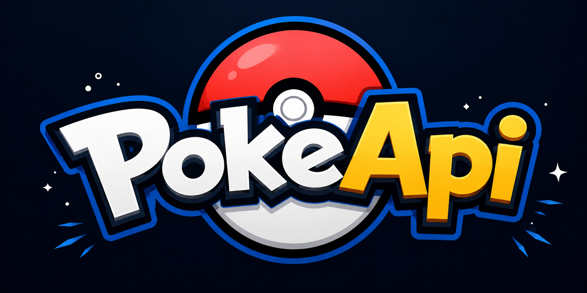
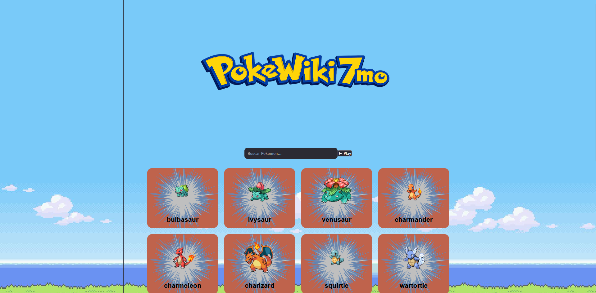

<div align="center">

# 🟡 PokeApi



### Aplicación desarrollada con React que consume la PokeAPI para visualizar información de los primeros 151 Pokémon.


</div>

---

# 📖 Descripción

Este proyecto consiste en una aplicación web desarrollada con **React** que consume datos de la **PokeAPI** utilizando peticiones HTTP.

La aplicación obtiene información de los **151 Pokémon originales**, mostrando cada uno mediante tarjetas dinámicas con su imagen, nombre y demás información obtenida desde la API.

Además incorpora un sistema de **paginación**, componentes reutilizables y un **hook personalizado** para mantener el código organizado y fácil de mantener.

---

# ✨ Funcionalidades

- 🔍 Consumo de datos desde una API REST.
- 🎴 Tarjetas individuales para cada Pokémon.
- 📄 Sistema de paginación.
- ⚡ Carga dinámica mediante Fetch API.
- 🧩 Componentes reutilizables.
- 🎨 Diseño responsive.
- ⚙️ Hook personalizado para la obtención de datos.

---

# 🛠 Tecnologías utilizadas

| Tecnología | Uso |
|------------|-----|
| React | Construcción de la interfaz |
| Vite | Entorno de desarrollo |
| Bun | Gestor de paquetes y ejecución |
| CSS | Estilos de la aplicación |
| Fetch API | Consumo de la API |
| JavaScript | Lógica del proyecto |

---

# 📂 Estructura del proyecto

```
src/
│
├── assets/
│
├── components/
│   ├── Pagination.jsx
│   └── PokemonCard.jsx
│
├── hooks/
│   └── useFetchData.jsx
│
├── App.jsx
├── main.jsx
└── App.css
```

---

# 🔄 ¿Cómo funciona?

El proyecto utiliza un **Hook Personalizado (`useFetchData`)** encargado de realizar la petición HTTP a la API.

Cuando la aplicación inicia:

1. Se ejecuta el Hook.
2. Se realiza una petición a la PokeAPI.
3. Se almacenan los datos en el estado.
4. React renderiza las tarjetas automáticamente.
5. La paginación permite navegar entre los Pokémon sin recargar la página.

Todo el flujo aprovecha el ciclo de vida de React mediante **useEffect** y **useState**.

---

# 🌐 API utilizada

La aplicación consume la API pública de Pokémon.

https://pokeapi.co/

Ejemplo de endpoint utilizado:

```
https://pokeapi.co/api/v2/pokemon?limit=151
```

---

# 🚀 Instalación

Clonar el repositorio

```bash
git clone https://github.com/tobfernandez12/api-react.git
```

Entrar al proyecto

```bash
cd api-react
```

Instalar dependencias

```bash
bun install
```

Ejecutar el servidor

```bash
bun run dev
```

Compilar para producción

```bash
bun run build
```

---

# 📱 Responsive

La aplicación fue diseñada para funcionar correctamente en:

- 💻 Computadoras
- 📱 Celulares
- 📟 Tablets

---

# 📷 Vista previa

> Agregá acá una captura de pantalla de la aplicación.

md



---

# 📚 Conceptos aplicados

- Componentes
- Props
- Hooks
- Custom Hooks
- useState
- useEffect
- Fetch API
- Renderizado dinámico
- Paginación
- Organización del código
- Responsive Design

---

# 👨‍💻 Autor

**Tobías Fernández**

GitHub

https://github.com/tobfernandez12

---

<div align="center">

⭐ Si te gustó el proyecto, no olvides dejar una estrella en el repositorio.

</div>
